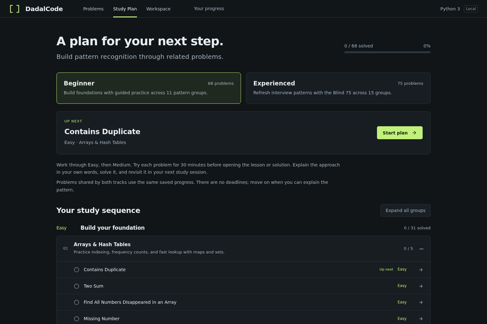
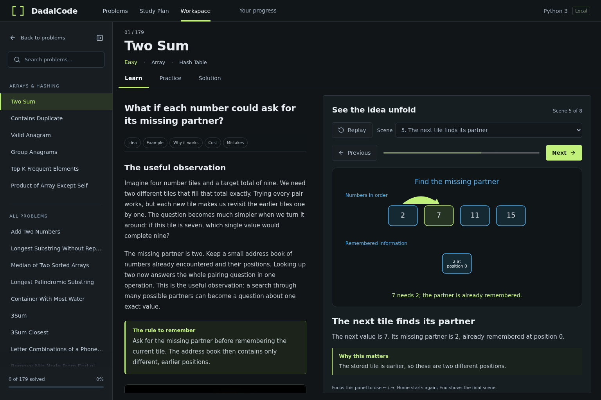
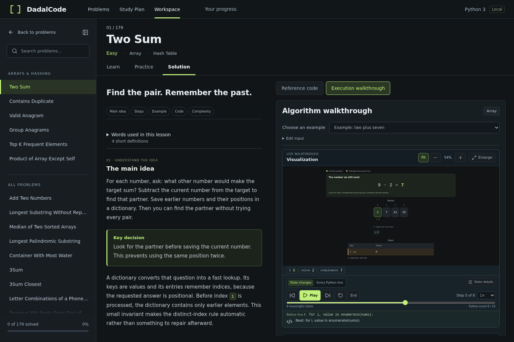
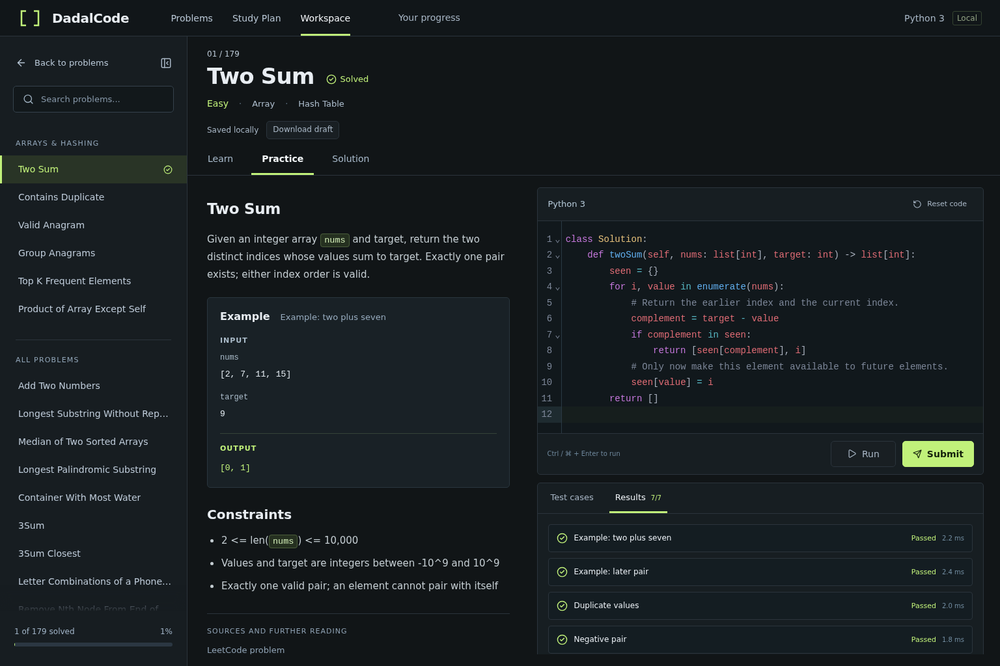

# DadalCode

A desktop Python algorithm trainer covering all **179 problems** in [Sean Prashad's LeetCode Patterns collection](https://seanprashad.com/leetcode-patterns/). Includes 179 visual algorithm lessons, executable reference walkthroughs, a Python editor, commented solutions, and locally saved progress. All 13 premium-listed problems include publicly accessible alternative statement sources.

**Licensing:** original application code is MIT; the adapted catalog and roadmaps are CC BY-NC 4.0. See [third-party notices](THIRD_PARTY_NOTICES.md).

**Supported experience:** desktop browsers (1280px or wider recommended). Phone layouts are not a release target.

[Contributing](CONTRIBUTING.md) · [Security](SECURITY.md) · [Releasing](RELEASING.md)

## Screenshots

**Choose a study plan.** Follow the beginner roadmap or the experienced Blind 75 track, with progress saved locally.



**Understand the idea.** Read a conceptual lesson beside its narrated visual story.



**Connect the idea to code.** Solution opens with Reference code; switch to Execution walkthrough for Python playback and custom inputs.



**Practice in Python.** Edit your solution and submit it against the problem's test cases.



## Run locally

Requires Node.js 24 LTS (or 22.13+) and npm. Python 3.12 on Linux/macOS or WSL is needed only for development tests. In this directory:

```sh
npm ci
npm run dev
```

Open **http://127.0.0.1:5173**. Keep this origin/port to retain the same browser progress. Installation copies Pyodide's matching runtime and standard library into `public/pyodide/`; Python, content, and diagrams are subsequently served locally. No API keys, server-side Python, or accounts are required. Internet is needed for initial dependency installation and external source links, not normal study or execution.

## Study and practice

- **Problems:** search the entire catalog and filter by pattern, difficulty, or progress.
- **Study Plan:** follow Sean Prashad’s beginner roadmap (68 problems in 11 groups) or experienced / Blind 75 roadmap (75 problems in 15 groups). Work through Easy, Medium, then Hard within ordered pattern groups. Start or continue the next unsolved problem, expand groups to browse, and use the plan links in the workspace to return or move forward. Both tracks share your existing completion records; reloadable hash routes retain the selected track.
- **Learn:** explore a problem-specific question, the obvious approach’s limitation, a useful observation, an authored example, correctness, cost, and common mistakes. All 179 lessons have local generated artwork and at least eight narrated scenes (1,433 total). Exact values and relationships live in accessible HTML/SVG. Previous, Next, scene selection, and Replay are manual; Replay returns to the beginning. Focus the visual story to use Left/Right or Home/End. Narration is selectable, and reduced-motion preferences disable scene transitions. Learn does not initialize Python.
- **Execution walkthrough (in Solution):** select an authored example or edit JSON and Apply. Step through meaningful state changes or every Python line; play, scrub, reset, jump to the end, and change speed. Focus the walkthrough and use Left/Right, Home/End, or Space. Sticky controls remain visible while the diagrams scroll. Line snapshots show the state **before** the highlighted instruction; return events include that function's result.
- **Diagrams:** inspect indexed arrays and strings, paired grid coordinates, heap trees, stack/queue order, shared interval scales, bit positions, and rolling DP state. Stable node identities keep pointers attached as linked-list links change; graph views distinguish current, visited, and queued nodes. Changed values and links are highlighted. Word Squares, N-Queens, elevation profiles, coin transitions, and flood-fill grids have additional visual explanations.
- **Practice:** write Python, Run the selected example or custom input, or Submit against the complete local fixture suite. `Ctrl/⌘ + Enter` runs; add Shift to submit. Passing all tests marks a problem solved.
- **Solution:** opens with **Reference code** beside the complete code-oriented editorial. All 537 annotations retain their exact source fragments. **Execution walkthrough** preserves playback controls and custom inputs. Practice and Solution show supplied Python class definitions. Opening either view preserves your draft.
- The lesson and workspace panes scroll independently. Learn’s chapter buttons jump to Idea, Example, Why it works, Cost, and Mistakes; Solution retains editorial and code chapters. Drag the divider or focus it and use arrow keys; collapse the problem sidebar for more room.

Drafts, completion, and the last submission summary are stored in IndexedDB in your current browser. The workspace shows saving status and offers a draft download. Concurrent edits in different tabs require an explicit conflict choice. Use **Your progress** to export a JSON backup or import missing records; imports preserve existing drafts. Clearing browser/site data removes them. This is a personal local practice tool; test cases are inspectable and are independent of LeetCode's judge. Completion records the last successful full submission, even if you later edit the draft.

Code runs in a terminable Web Worker to keep the interface responsive. Each case has a three-second execution limit and each suite fifteen seconds, excluding Python initialization. Console capture is bounded to 64 KiB. Visualization inputs should be small: traces stop at 2,000 steps and complex snapshots show bounded portions of large structures. A visible notice identifies trace truncation. Stop or a timeout terminates the worker; subsequent runs start cleanly. A worker is a responsiveness boundary for this personal tool, not a hosted multi-user security sandbox.

## Verify

Builds use TypeScript 7 through the `@typescript/native` npm alias. ESLint still
requires the TypeScript 6 API, so the `typescript` dependency aliases
`@typescript/typescript6`. Keep both aliases when updating the toolchain until
typescript-eslint supports the new compiler API. This follows Microsoft's
[side-by-side setup](https://devblogs.microsoft.com/typescript/announcing-typescript-7-0/#running-side-by-side-with-typescript-6.0).

```sh
npm test                 # Python 3: regression suites + curriculum fixtures + review fingerprints
npm run test:content     # Content checks during edits, before recording a new review
npm run build           # TypeScript checks + production build
npm run test:visuals    # pointer, graph, trie, heap, grid rendering regressions
npx playwright install chromium
npm run dev             # leave running in another terminal
npm run test:browser     # desktop interactions and persistence
npm run test:plans       # study tracks, shared progress, and next-problem navigation
npm run test:viewer      # Solution fitted/expanded execution diagrams
npm run test:concepts    # all 179 lessons/scenes, local art, navigation, motion, no Python in Learn
npm run test:runtime     # all 179 suites and traces in browser Pyodide
```

Browser tests default to `http://127.0.0.1:5173`. UI tests accept `APP_URL` and `CHROME_PATH`; runtime tests accept `TRAINER_BASE_URL` and `PLAYWRIGHT_CHROMIUM_EXECUTABLE`. Screenshots go to the operating system's temporary directory under `dadalcode-qa`, not the application bundle. Tests use fresh browser storage.

## Project structure

- `public/problems/<slug>/`: lesson, `explanation.json` (required conceptual lesson plus preserved code editorial), Python solution/starter, fixtures, and adapter.
- `public/illustrations/<slug>/`: locally packaged ImageGen artwork and its generation record for every problem. Captions describe intuition; exact example values are authored in SVG.
- `src/runtime/`: shared CPython/Pyodide harness, worker, timeout/cancellation controller.
- `src/components/`: lesson, editor, results, and trace renderers. `concepts/diagrams/<slug>.ts` supplies each problem’s own scene compositions through a lazy registry.
- `scripts/concept-manuscripts.json`: authored conceptual prose and scene geometry. `author-concepts.py` writes lessons and diagram modules without executing Python solutions. `concept-art-prompts.json` retains the distinct artwork prompts.
- `src/data/`: pinned original catalog, corrected metadata, study plans, loading, persistence.
- `tests/review-ledger.json`: independent curriculum and editorial review, repaired findings, and hashes of all six files in each reviewed problem package, plus its conceptual renderer, artwork, and generation records.
- `tests/test_curriculum_group_*.py`: generated boundary cases, seeded independent oracles, and invalid-candidate regressions. Large cases stay out of the teaching walkthroughs.
- `scripts/content_contracts.py`: shared authoring contracts for metadata, JSON fixtures, public signatures, adapter hooks, and review fingerprints.
- `PROBLEM_CONTRACT.md`: contract for maintaining problem packages.

Integer answers are compared exactly even if a learner returns a float. Median and other floating-answer problems declare their own tolerance checks. Encoding problems verify reconstruction with fresh class/global state; explicit arithmetic and library-sort restrictions have source checks. Linked-list output supports the full 50,000-node Sort List domain while visual snapshots remain bounded.

After reviewing a content change, use `python scripts/record_content_review.py --slug <slug>` to refresh its package and concept-visual fingerprints. This records a completed review; it does not perform one. `npm test` detects later changes to package files, renderers, artwork, or generation records. See [concept authoring and review](docs/CONCEPT_LESSONS.md).

The curriculum was authored and reviewed through an agent-assisted workflow, with separate authorship and review passes. These checks are not external human certification. Original source IDs are preserved separately from canonical LeetCode numbers. See [THIRD_PARTY_NOTICES.md](THIRD_PARTY_NOTICES.md) for source attribution and licenses.

The lesson workspace targets desktop. In Solution, execution visualizations fit a bounded frame with Fit/zoom controls and an Enlarge button that keeps playback and the current instruction in view. State details are available in a drawer; Edit input expands the JSON editor. The viewer is checked at 1536×1024, 1280×800, and 1280×600, plus a narrow expanded window. Desktop is the supported layout; cloud sync and analytics are not used.

Figures use separate presentations for indexed arrays/strings, linked-list value/next cells, trees, tries, graphs, coordinate matrices, DP rows/tables, maps, unordered sets, stacks, queues, heaps, intervals, and bits. `FigureRenderer` dispatches captured values; `visualization.renderers` can select a presentation per variable. Problem-specific choices live in `src/data/visualizationBindings.ts`, alongside pointer bindings. For example, Two Sum uses `{ nums: "array", seen: "map" }`, while Meeting Rooms II uses `{ intervals: "intervals", active_ends: "heap" }`. Automatic shape detection remains available for other variables. Lime marks current positions, amber marks edits, and blue marks frontier/context; tooltips and labels explain these states without relying on color alone.
