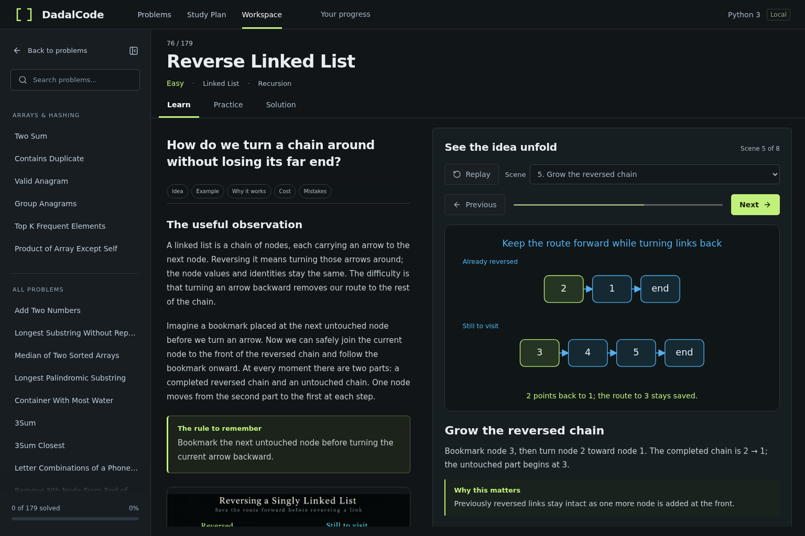

# Concept lessons

Learn introduces algorithms through questions, observations, and narrated visual
choices. All 179 problems have their own lesson, local generated illustration,
and scene compositions. There are 1,433 scenes; Pacific Atlantic Water Flow adds
an Atlantic-side example to the usual eight-scene structure. The first lessons
were Two Sum, Coin Change, and Reverse Linked List.




## Authoring

Edit the problem’s entry in `scripts/concept-manuscripts.json`. The manuscript
contains conceptual prose and exact geometry for each scene. The three initial
lessons use explicit scene drawings in `scripts/author-concepts.py`. Shared
geometry helpers in `scripts/concept-authoring.py` draw only supplied state;
they never infer lessons from Python execution.

Use stable semantic scene IDs when editing or inserting scenes. Each scene
needs a title, selectable narration, a decision explanation, and a drawing with
an accessible description. Main examples must agree with an existing authored
fixture. Label separate counterexamples and boundaries explicitly.

Explain the bottleneck, saved information, safe choice, complete answer, cost,
and likely mistakes. Use familiar quantities and language. Leave Python source
names, syntax, line numbers, code annotations, and custom input execution in
Solution.

Run:

```sh
python scripts/author-concepts.py
npm run test:content
npm run test:concepts
```

The authoring command preserves the original editorial and exact source snippets
in each `explanation.json`. It writes the required `concept` section, a renderer
module per slug, and the lazy registry. Renderer modules contain serialized JSON
geometry inside TypeScript; Prettier excludes that generated directory so the
content validator can inspect the same data consumed by the player.

Generate artwork with the built-in `image_gen.imagegen` tool. Keep the actual
prompt in `scripts/concept-art-prompts.json` and the problem’s `generation.json`.
`scripts/save-concept-art.py <generated-image-path> <slug>` packages an image as
local WebP. Supply captions and visual alt text in the manuscript, then rebuild.
After a regenerated image, keep its generation record’s prompt aligned with the
actual prompt before rebuilding. Add further illustrations when they clarify a
separate idea; extend the manuscript builder and concept references accordingly.

The generated image communicates intuition. Put exact values, ordered positions,
links, arrows, and state changes in HTML/SVG. Review images themselves; a prompt
or file-presence check cannot establish mathematical accuracy.

## Review and validation

Authoring and review are separate passes. Review every lesson’s main fixture,
intermediate arithmetic, choices, correctness, cost, boundary cases, diagram
geometry, and illustration. The implementation review repaired, among other
findings, highlights on duplicate-valued tree nodes, zero-height water columns,
paired graph/tree comparisons, and misleading generated interval, bit, and
backtracking illustrations. Artwork was inspected individually through grouped
review sheets; misleading images were regenerated and inspected again.

`tests/concepts.mjs` visits every problem and scene, checks narration and diagram
bounds, decodes local artwork, tests manual navigation, Replay, keyboard focus,
problem changes, and reduced motion. It asserts that Learn creates no Python
worker and requests no Python runtime files. It also captures all 12 diagram
families at 1536×1024, 1280×800, and 1280×600. The panels scroll independently at
short heights. To retain scene screenshots for a review:

```sh
CAPTURE_CONCEPT_REVIEW=1 npm run test:concepts
```

Screenshots go to the system temporary directory under `dadalcode-qa`.
`scripts/concept_contracts.py` rejects missing prose, repeated scene IDs, source
syntax in Learn, missing or clipped geometry, absent assets, and inconsistent
generation records. The existing curriculum validator verifies the authored
example input/result against fixture data and executes all reference fixtures.
Independent curriculum tests continue checking algorithm and grading behavior.
These automated checks supplement the reasoning and visual review.

After completing review and passing content checks, record each reviewed slug:

```sh
python scripts/record_content_review.py --slug problem-slug
npm test
```

Repeat `--slug` for multiple reviewed problems. The ledger hashes each six-file
package and its renderer, illustrations, and generation records. It records a
completed review; it does not perform one. The review is agent-assisted and is
not external human certification.

## Runtime boundary

`ConceptPlayer` reads authored scenes and lazy per-slug geometry. It has no trace,
Python, captured-local, or execution dependency. Navigation is manual; Replay
returns to scene one. The SVG and narration update immediately, with a short
transition disabled by reduced-motion preferences.

Solution defaults to Reference code. Execution walkthrough retains the existing
Python player, custom inputs, controls, and annotations. Draft and progress
storage, routes, submissions, and study-plan behavior are unchanged.
